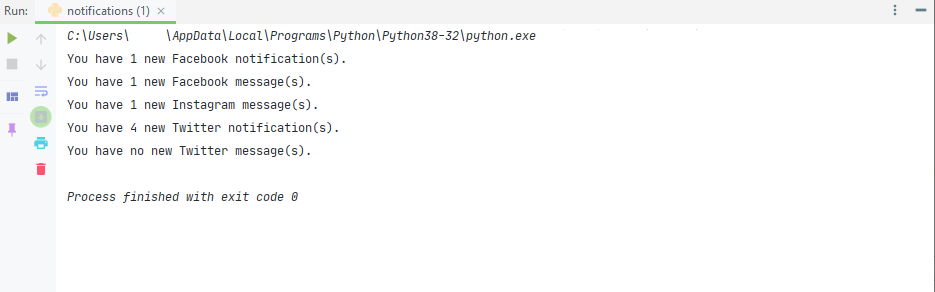

# Notifications in cmd

This little Python script uses Selenium to open a Browser and checks whether or not you have new notifications/messages on Facebook, Instagram and Twitter.

**NOTE**: If you want to use this, make sure you change the user data path to match your Chrome's profile data location, so you don't have to login everytime. Also, if you are going to use it to check Facebook notifications, make your you're using the old version of it, otherwise it wouldn't find you any notifications.

Example:

